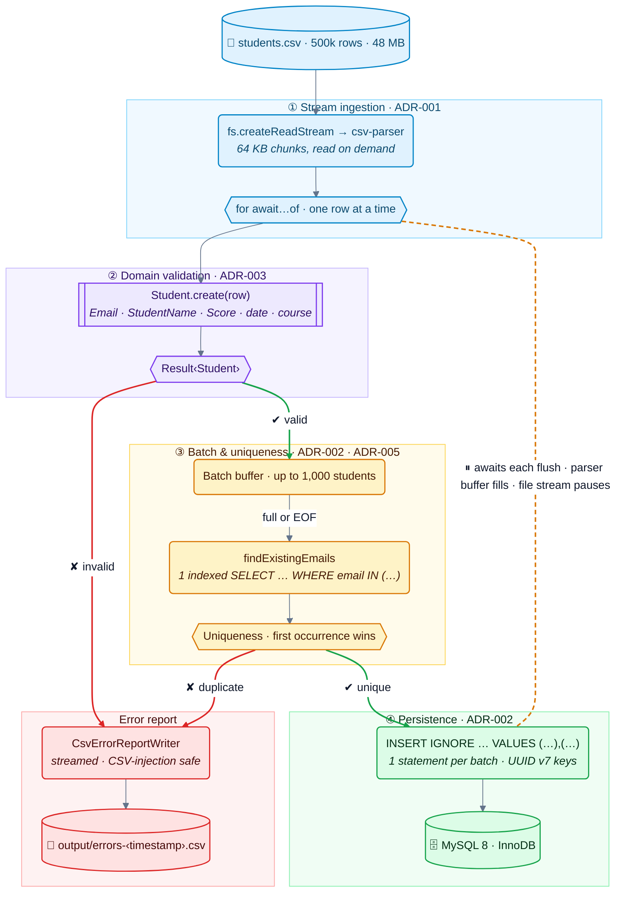
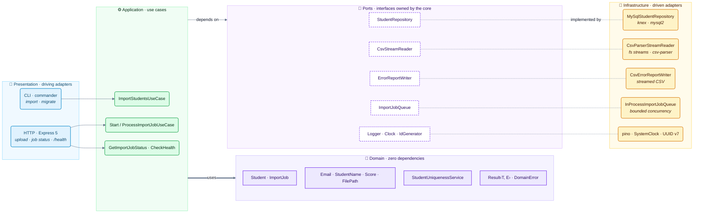

# 📦 csv-stream-importer

> Importing **500,000 CSV rows** into MySQL with Node.js — without blocking the Event Loop and in
> **under 80 MB of memory**.

[](https://www.typescriptlang.org/)
[](https://nodejs.org/)
[](https://www.mysql.com/)
[](https://docs.docker.com/compose/)
[](#-tests)
[](#-tests)
[](./LICENSE)

---

## 🎯 The Problem

> *"You need to import a CSV with 500,000 lines, validate the data and insert it into MySQL. How do
> you design it in Node.js so it doesn't freeze the application (Event Loop) or crash the server
> (OOM)?"*

The obvious implementation — `readFileSync` → `split('\n')` → `forEach` → `INSERT` — fails on all
three fronts:

| Approach | Event Loop | Memory | Database load |
|---|---|---|---|
| `readFileSync` + `forEach` | ❌ frozen for the whole parse | ❌ grows with the file (590 MB for 48 MB of CSV) | — |
| … + one `INSERT` per row | ❌ | ❌ | ❌ 500,000 round-trips (126 rows/s) |
| **Stream + validate + batched bulk `INSERT`** | ✅ longest block 54 ms | ✅ **78.7 MB, flat** | ✅ ~500 bulk INSERTs (8,470 rows/s) |

*All numbers measured on this repository — see [Benchmarks](#-benchmarks).*

## 💡 The Solution



Memory is bounded by **one chunk + one batch**, whatever the file size (under 80 MB RSS — [ADR-004](docs/adr/004-memory-budget-and-heap-tuning.md)). Invalid rows never reach the database, and every rejected field is reported with its line number.

> 🔎 The backpressure sequence diagram, the HTTP job lifecycle and the layer map are detailed in
> [`docs/architecture.md`](docs/architecture.md) (in Portuguese).

## 🏗️ Architecture

**Clean Architecture + DDD + TypeScript (strict)** — dependencies always point inward, and the
rule is **enforced by ESLint** (`no-restricted-imports` per layer: the Domain cannot import
anything outside itself, the Application cannot import frameworks or outer layers).



```
src/
├── domain/                 # zero dependencies
│   ├── entities/           # Student, ImportJob (lifecycle: pending → processing → completed|failed)
│   ├── value-objects/      # Email, StudentName, Score, FilePath — immutable, validated on creation
│   ├── services/           # StudentUniquenessService (one student per email, first wins)
│   ├── repositories/       # StudentRepository, ImportJobRepository (ports)
│   ├── errors/             # DomainError hierarchy (InvalidEmailError, DuplicateStudentError…)
│   └── shared/result.ts    # Result<T, E>
├── application/
│   ├── use-cases/          # ImportStudents, StartImportJob, ProcessImportJob, GetImportJobStatus, CheckHealth
│   ├── interfaces/         # ports: CsvStreamReader, ErrorReportWriter, Logger, ImportJobQueue…
│   ├── dtos/               # ImportStudentsInput/Output, ImportJobStatusOutput…
│   └── errors/             # ApplicationError hierarchy (ImportFailedError…)
├── infrastructure/
│   ├── csv/                # CsvParserStreamReader (createReadStream + csv-parser)
│   ├── database/           # knex/mysql2 pool, migrations, MySqlStudentRepository
│   ├── filesystem/         # CsvErrorReportWriter (streamed, CSV-injection safe)
│   ├── queue/              # InProcessImportJobQueue (bounded concurrency + backlog)
│   ├── config/             # zod-validated env, composition root (container.ts)
│   ├── logging/            # pino
│   └── lifecycle/          # graceful shutdown
└── presentation/
    ├── cli/                # commander: `import`, `migrate`
    └── http/               # Express 5: streaming multipart upload, job status, /health
```

### Key technical decisions (ADRs)

| Pipeline stage | Decision | Rationale | ADR |
|---|---|---|:---:|
| **① Ingestion** | Streams over `readFileSync` | Flat memory, free Event Loop, backpressure via `for await` | [ADR-001](docs/adr/001-streams-over-readfile.md) |
| **② Domain** | Result pattern | Expected failures are typed return values (`Result<T, E>`), not exceptions | [ADR-003](docs/adr/003-result-pattern.md) |
| **② Domain** | Value Objects for validation | Immutable, invariants enforced before any database I/O | — |
| **③ Batching** | Batches of 1,000 rows | 99.9 % fewer round-trips than row-by-row; configurable default | [ADR-002](docs/adr/002-bulk-insert-batch-size.md) |
| **③ Batching** | Uniqueness with O(batch) memory | One indexed email lookup per batch instead of a global `Set` of 500k emails | [ADR-005](docs/adr/005-email-uniqueness-with-bounded-memory.md) |
| **④ Persistence** | UUID v7 primary keys (RFC 9562) | Time-ordered keys append to the end of the InnoDB clustered index (fewer page splits) | [ADR-002](docs/adr/002-bulk-insert-batch-size.md) |
| **Whole process** | Heap budget (`--max-old-space-size=64`) | Live heap is ~16 MB; a capped V8 keeps RSS under 80 MB at the same speed | [ADR-004](docs/adr/004-memory-budget-and-heap-tuning.md) |

## 📊 Benchmarks

### `readFileSync` vs `createReadStream` — `npm run benchmark`

500,000 rows (48.4 MB), parse + domain validation, each strategy in a fresh process
(Node 24, Windows 11, i5-13450HX). Full report: [`benchmarks/results.md`](benchmarks/results.md).

| Metric | `readFileSync` | `createReadStream` |
|---|---:|---:|
| Peak heap used | 438.9 MB | 63.9 MB |
| Peak memory (RSS) | 590.9 MB | 177.6 MB |
| **Longest Event Loop block** | **3.59 s** | **54 ms** |
| Total time | 3.59 s | 5.66 s |
| **With a 64 MB heap cap** | **💥 JavaScript heap out of memory** | ✅ 71.1 MB RSS |

The sync version is faster on raw parsing — and freezes the process for its whole duration: no
HTTP response, no health check, no timer for 3.6 seconds.

### Real import into MySQL — `npm run import:prod`

| | Value |
|---|---:|
| Rows processed | 500,000 |
| Rows imported | 475,074 |
| Rows rejected (validation + duplicates) | 24,926 |
| Duration | 59.0 s |
| Throughput | 8,470 rows/s |
| **Peak memory (RSS)** | **78.7 MB** |

### Batch size (120k rows into MySQL)

| Batch size | 1 | 100 | **1,000** | 5,000 | 10,000 |
|---|---:|---:|---:|---:|---:|
| Rows/s | 126 | 6,659 | **8,587** | 15,335 | 16,396 |
| Peak RSS | 71.5 MB | 74.6 MB | **75.9 MB** | 78.6 MB | 100.4 MB |

Why 1,000 stays the default despite 5,000 being faster on a dedicated database:
[ADR-002](docs/adr/002-bulk-insert-batch-size.md).

## 🚀 Quick Start

### Prerequisites

- Docker & Docker Compose
- Node.js **22.22+** (Node 24 LTS recommended)

### Option A — everything in Docker

```bash
docker-compose up -d          # MySQL 8 + the HTTP API (migrations run on start)
curl localhost:3000/health    # {"status":"ok","checks":{"database":"up"},...}
```

### Option B — CLI on the host

```bash
docker-compose up -d mysql                     # 1. MySQL only
cp .env.example .env                           # 2. configuration
npm install                                    # 3. dependencies
npm run migrate                                # 4. create the students table
npm run generate -- --rows 500000              # 5. fake CSV, ~5% invalid rows (seeded faker)
npm run import -- --file ./data/students.csv   # 6. import!
```

```
✅ Import Complete
────────────────────────────────────
Total processed:           500,000
Total imported:            475,074
Total errors:               24,926
Duration:                    59.0s
Peak memory:                78.7MB
Rows/second:                 8,470
────────────────────────────────────
Error report: output/errors-2026-10-05T14-04-02-991Z.csv
```

Progress is logged (pino, JSON) every 10,000 rows. **Ctrl+C** stops gracefully: the batch in
progress is flushed, the error report is closed and the summary is printed (exit code 130).

### Error report

`output/errors-<timestamp>.csv` — one line per rejected field:

```csv
line_number,field,value,error_message
23,email,,Email is required
43,name,A,Name must be at least 2 characters
68,score,104.50,Score must be between 0 and 100
79,email,jess.kuhic.77.at.school.edu,Email must be a valid address
2108,email,student.5@school.edu,A student with this email is already registered
```

Values starting with `=`, `+`, `-`, `@` are prefixed with `'` so the report is safe to open in a
spreadsheet (CSV injection).

### HTTP API (bonus)

| Method | Path | Description |
|---|---|---|
| `POST` | `/api/import?batchSize=1000` | `multipart/form-data` with a `file` field (`.csv`, ≤ 200 MB). The upload is **streamed to disk** (never buffered in memory). → `202 { jobId, statusUrl }` |
| `GET` | `/api/import/:jobId/status` | `pending` → `processing` → `completed` (with the `ImportStudentsOutput`) or `failed` |
| `GET` | `/health` | `200` when MySQL answers, `503` otherwise |

```bash
curl -F "file=@data/students.csv" "localhost:3000/api/import?batchSize=1000"
# {"jobId":"0199b1c2-…","statusUrl":"/api/import/0199b1c2-…/status"}
curl localhost:3000/api/import/0199b1c2-…/status
```

Jobs run in an in-process queue with bounded concurrency (`IMPORT_QUEUE_CONCURRENCY`) and a
bounded backlog (`IMPORT_QUEUE_MAX_PENDING`): beyond it the API answers `503` + `Retry-After`
instead of accepting work it cannot handle. On `SIGTERM` the server stops accepting connections,
aborts running imports after their current batch, cancels queued jobs and closes the pool.

## 🧪 Tests

```bash
npm test               # everything (unit + integration + e2e) — Docker required
npm run test:unit      # fast, no Docker
npm run test:int       # adapters against real MySQL 8 (Testcontainers) and real files
npm run test:e2e       # CSV → validation → MySQL through the CLI and the HTTP API
npm run test:coverage  # with coverage thresholds
```

| Suite | What it covers |
|---|---|
| **Unit** (205 tests) | Value Objects, entities, domain service, UUID v7 ordering properties, every use case (happy path, partial failures, empty file, duplicates across batches, abort, DB/stream failures, **backpressure**), HTTP layer with fakes, queue, graceful shutdown, config |
| **Integration** (20 tests) | `MySqlStudentRepository` + migrations on MySQL 8 (Testcontainers), UUID v7 vs v4 physical ordering in InnoDB, CSV reader on real files (BOM, CRLF, quotes, oversized rows, early release of the file handle), error report writer |
| **E2E** (6 tests) | Full import via the CLI command and via upload + job polling over HTTP; idempotent re-import |

### Coverage

| Layer | Statements | Branches |
|---|---:|---:|
| Domain | 100 % | 100 % |
| Application | 100 % | 97 % |
| **Overall** | **96 %** | **90 %** |

## 🛠️ Scripts

| Script | Description |
|---|---|
| `npm run dev` | HTTP API with hot reload (tsx) |
| `npm run build` / `npm start` | Compile to `dist/` / run the compiled API |
| `npm run import -- --file <csv> [--batch-size n]` | Import a CSV (64 MB heap cap) |
| `npm run import:prod -- --file <csv>` | Same, from the compiled build |
| `npm run migrate` / `npm run migrate:rollback` | Database migrations |
| `npm run generate -- --rows 500000 [--error-rate 0.05] [--seed 42]` | Fake CSV generator (faker) |
| `npm run seed` | Migrate + generate 10k rows + import them |
| `npm run benchmark` | `readFileSync` vs `createReadStream` → `benchmarks/results.md` |
| `npm run benchmark:uuid` | UUID v4 vs v7 insert throughput and clustered-index ordering (Testcontainers MySQL) |
| `npm run lint` / `typecheck` / `format` | Quality gates |

Configuration is read from the environment and validated with zod at startup — see
[`.env.example`](.env.example).

## 📚 Tech Stack

| Technology | Role |
|---|---|
| **TypeScript 5.9** (strict, `noUncheckedIndexedAccess`) | Language |
| **Node.js 24** | Runtime (streams, `pipeline`, `AbortController`) |
| **csv-parser** | Streaming CSV parser (Transform stream) |
| **mysql2 + knex** | MySQL driver, query builder, migrations |
| **Express 5 + busboy** | HTTP API, streaming multipart upload |
| **commander** | CLI |
| **zod** | Validation of env vars, CLI options, HTTP input |
| **pino** | Structured JSON logging |
| **uuid (v7)** | Time-ordered primary keys |
| **Jest + ts-jest + supertest + Testcontainers** | Unit, integration and e2e tests |
| **@faker-js/faker** | Test data generation |
| **Docker Compose** | MySQL + API locally; multi-stage production image |

> Tooling notes: ESLint 9 uses the flat config (`eslint.config.mjs`) because ESLint 9 no longer
> reads `.eslintrc.json`; Jest 30 is used instead of 29 (same API, no vulnerable transitive
> dependencies); path aliases are resolved at runtime by `tsconfig-paths` (`src/module-aliases.ts`).

## 📖 Related

- [Node.js — Backpressuring in Streams](https://nodejs.org/en/learn/modules/backpressuring-in-streams)
- [Node.js — Stream API](https://nodejs.org/api/stream.html)
- [MySQL — Optimizing INSERT Statements](https://dev.mysql.com/doc/refman/8.0/en/insert-optimization.html)
- [V8 — Trash talk: the Orinoco garbage collector](https://v8.dev/blog/trash-talk)

## 📄 License

[MIT](./LICENSE)
