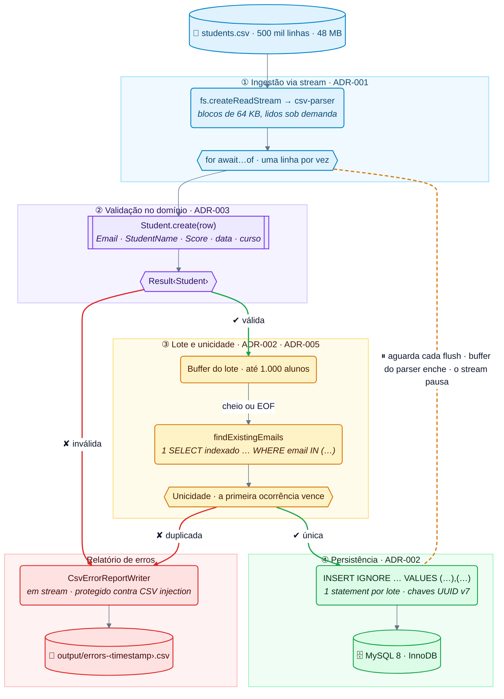
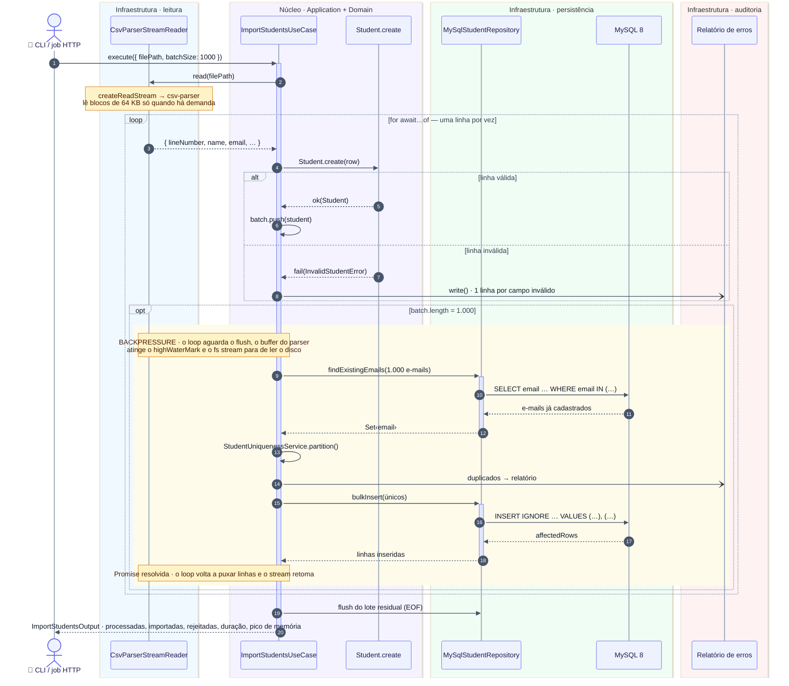
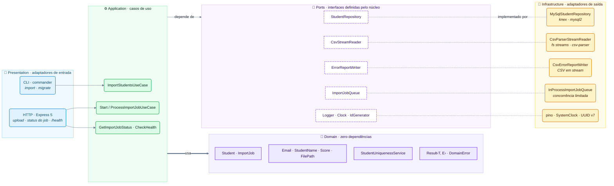
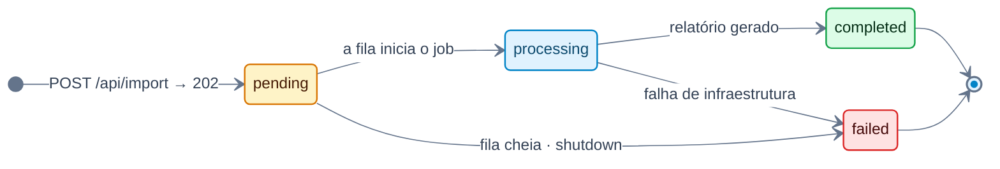

# Arquitetura e Engenharia de Solução — csv-stream-importer

> Documentação técnica detalhada do fluxo de ingestão massiva de dados, modelo de domínio e garantias de contenção de recursos.

---

## 1. Visão Geral do Pipeline de Dados

O diagrama abaixo ilustra o fluxo ponta a ponta desde a leitura física do arquivo CSV até a gravação final no MySQL 8 InnoDB, destacando os mecanismos de **Backpressure**, **Validação no Domínio**, **Tratamento de Duplicidades** e **Isolamento de Erros**.

---

## 2. Diagrama de Sequência: Backpressure e I/O Assíncrono

O diagrama abaixo detalha a coordenação temporal e o controle de fluxo entre a leitura de disco, o Event Loop do Node.js e o banco de dados MySQL:

---

## 3. Arquitetura em Camadas (Clean Architecture & DDD)

O projeto segue estritamente os princípios da **Clean Architecture** e **Domain-Driven Design**. As dependências apontam exclusivamente para o centro (Domain), regra validada em tempo de compilação e garantida pelo ESLint (`no-restricted-imports`):

---

## 4. Ciclo de Vida do Job de Importação (API HTTP)

Uploads recebidos em `POST /api/import` viram um `ImportJob` processado em background por uma fila em processo com concorrência e backlog limitados. As transições são invariantes da entidade — transições inválidas retornam `InvalidImportJobTransitionError`:

| Transição | Quem dispara |
|---|---|
| `pending → processing` | `InProcessImportJobQueue` inicia o `ProcessImportJobUseCase` |
| `pending → failed` | fila cheia (`503` + `Retry-After`), ou shutdown antes do início |
| `processing → completed` | importação concluída (inclusive abortada por `SIGTERM` após o lote corrente) |
| `processing → failed` | falha de infraestrutura (MySQL fora do ar, stream corrompido…) |

---

## 5. Garantias de Performance e Recursos

| Mecanismo | Problema Evitado | Garantia Técnica |
|---|---|---|
| **Backpressure Automático** | Out of Memory (OOM) | O consumo do stream é suspenso enquanto a Promise de inserção no MySQL é resolvida. O arquivo só é lido conforme o banco consegue gravar. |
| **Memória $O(\text{batch})$** | Alocação linear com o tamanho do arquivo | A memória não cresce com o tamanho do arquivo: na importação de 500 mil linhas o pico foi de **78,7 MB RSS**, com heap vivo de ~16 MB (medido com GC forçado — [ADR-004](adr/004-memory-budget-and-heap-tuning.md)). |
| **Bulk INSERT (1.000 linhas)** | 500.000 round-trips e gargalo de rede | ~500 INSERTs em lote (+ ~500 SELECTs de unicidade) no lugar de 500.000 statements, atingindo **8.470 linhas/segundo**. |
| **UUID v7 (RFC 9562)** | Page splits e fragmentação no InnoDB | IDs com prefixo temporal de 48 bits são inseridos em ordem crescente no fim da árvore B+ do índice clusterizado, reduzindo page splits em relação ao UUID v4 aleatório (`npm run benchmark:uuid`). |
| **Isolamento de Erros via Stream** | Falhas silenciosas e injeção de fórmulas | Linhas rejeitadas são descarregadas em disco linha a linha no formato CSV, com escape contra CSV Injection para caracteres perigosos (`=`, `+`, `-`, `@`). |
