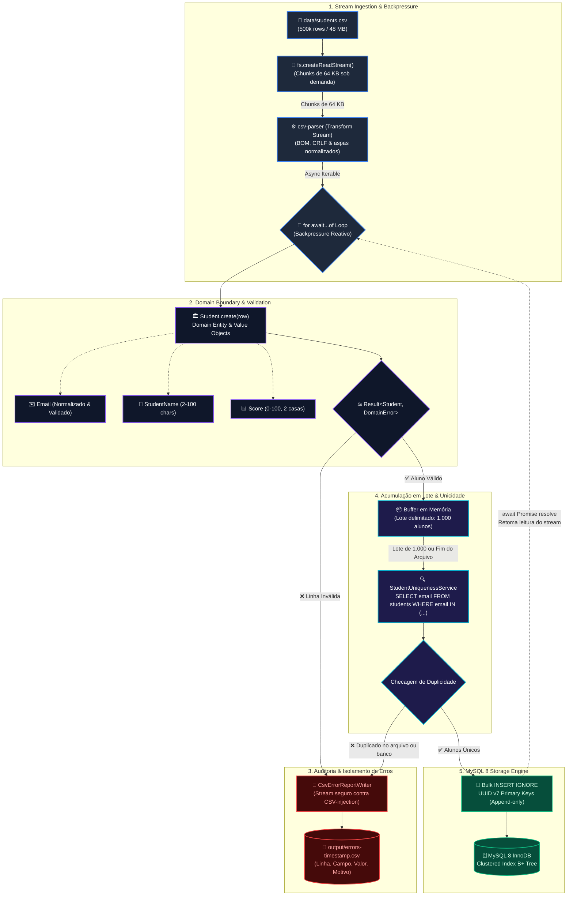
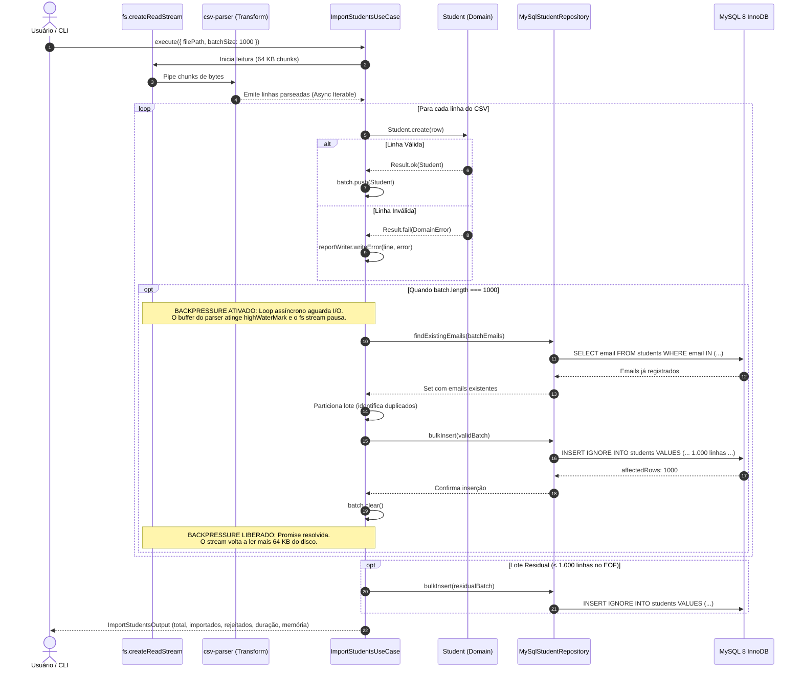
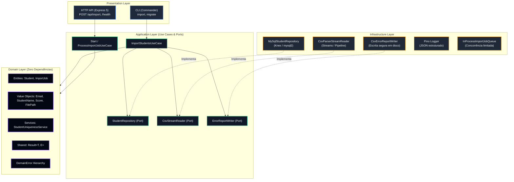

# Arquitetura e Engenharia de Solução — csv-stream-importer

> Documentação técnica detalhada do fluxo de ingestão massiva de dados, modelo de domínio e garantias de contenção de recursos.

---

## 1. Visão Geral do Pipeline de Dados

O diagrama abaixo ilustra o fluxo ponta a ponta desde a leitura física do arquivo CSV até a gravação final no MySQL 8 InnoDB, destacando os mecanismos de **Backpressure**, **Validação no Domínio**, **Tratamento de Duplicidades** e **Isolamento de Erros**.

---

## 2. Diagrama de Sequência: Backpressure e I/O Assíncrono

O diagrama abaixo detalha a coordenação temporal e o controle de fluxo entre a leitura de disco, o Event Loop do Node.js e o banco de dados MySQL:

---

## 3. Arquitetura em Camadas (Clean Architecture & DDD)

O projeto segue estritamente os princípios da **Clean Architecture** e **Domain-Driven Design**. As dependências apontam exclusivamente para o centro (Domain), regra validada em tempo de compilação e garantida pelo ESLint (`no-restricted-imports`):

---

## 4. Garantias de Performance e Recursos

| Mecanismo | Problema Evitado | Garantia Técnica |
|---|---|---|
| **Backpressure Automático** | Out of Memory (OOM) | O consumo do stream é suspenso enquanto a Promise de inserção no MySQL é resolvida. O arquivo só é lido conforme o banco consegue gravar. |
| **Memória $O(\text{batch})$** | Alocação linear com o tamanho do arquivo | A memória utilizada permanece estável em **~78 MB RSS** (heap ativo de ~16 MB), seja para 100 linhas ou 50.000.000 de linhas. |
| **Bulk INSERT (1.000 linhas)** | 500.000 round-trips e gargalo de rede | Reduz os round-trips em 99.9% (~500 statements no total) atingindo taxa de **8.470 linhas/segundo**. |
| **UUID v7 (RFC 9562)** | Page Splitting e fragmentação no InnoDB | IDs gerados com prefixo temporal de 48 bits resultam em append sequencial na ponta da árvore B+, mantendo alto índice de ocupação de página e eliminando rebalanceamento. |
| **Isolamento de Erros via Stream** | Falhas silenciosas e injeção de fórmulas | Linhas rejeitadas são descarregadas em disco linha a linha no formato CSV, com escape contra CSV Injection para caracteres perigosos (`=`, `+`, `-`, `@`). |
